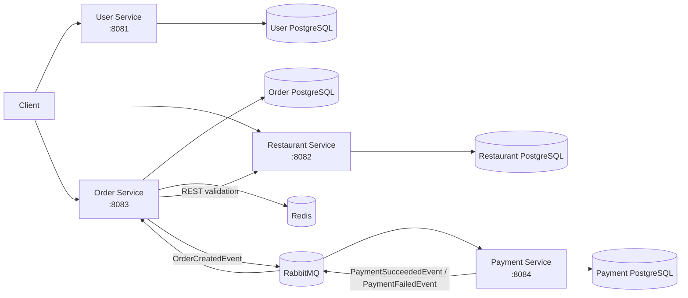
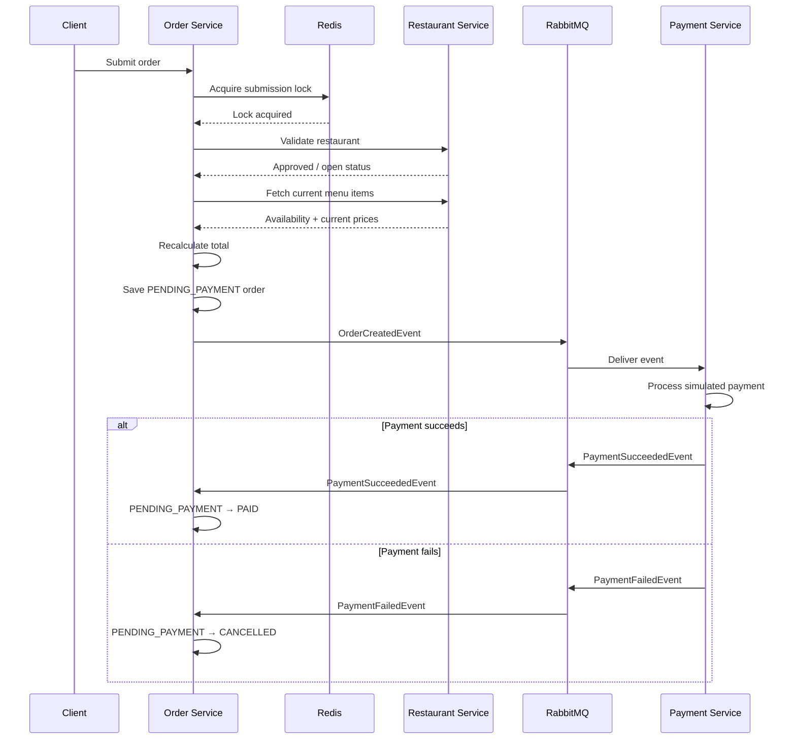

# OrderFlow

An event-driven food ordering backend built with **Java, Spring Boot, PostgreSQL, Redis, and RabbitMQ**.

OrderFlow models the core backend workflow of a food ordering platform across four independently developed services. It combines synchronous REST communication for checkout validation with asynchronous messaging for payment processing, Redis-backed transient state, database-per-service persistence, and integration testing with real infrastructure through Testcontainers.

## Architecture



The system follows a **database-per-service** model. Redis is used for transient application state and atomic operations, while RabbitMQ decouples order creation from payment processing.

## Services

### User Service

Handles user and account-related operations.

Implemented functionality includes:

- User registration
- Credential validation
- BCrypt password hashing
- User profile management
- Role management
- Account enable / disable state
- Default address management
- Soft deletion
- Pagination

### Restaurant Service

Owns restaurant and menu data.

Implemented functionality includes:

- Restaurant management
- Restaurant approval workflow
- Open / closed state
- Menu item management
- Menu categories and pricing
- Item availability
- Soft deletion

A restaurant must be approved before it can be opened for ordering.

### Order Service

Coordinates the checkout and order lifecycle.

Responsibilities include:

- Redis-backed shopping carts
- Cart expiration
- Duplicate order-submission protection
- Restaurant and menu validation
- Checkout price revalidation
- Order persistence
- Order state transitions
- RabbitMQ event publishing and consumption
- Menu-item popularity tracking

### Payment Service

Handles asynchronous simulated payment processing.

Responsibilities include:

- Consuming `OrderCreatedEvent`
- Creating payment records
- Preventing duplicate payments for the same order
- Simulating payment success or failure
- Publishing payment result events

> Payment processing is intentionally simulated; no external payment provider is currently integrated.

---

## Order Workflow

Checkout combines synchronous validation with asynchronous payment processing.



### Order State Transitions

```text
                    PaymentSucceededEvent
                           │
                           ▼
PENDING_PAYMENT ─────────► PAID
        │
        │ PaymentFailedEvent
        ▼
    CANCELLED
```

---

## Event-Driven Messaging

RabbitMQ is used to decouple order creation from payment processing.

### Order Created

```text
Order Service
     │
     │ order.created
     ▼
order.exchange
     │
     ▼
payment.order.created.queue
     │
     ▼
Payment Service
```

### Payment Result

```text
Payment Service
       │
       ▼
payment.exchange
       │
       ├── payment.succeeded
       │        │
       │        ▼
       │  order.payment.succeeded.queue
       │
       └── payment.failed
                │
                ▼
          order.payment.failed.queue
                │
                ▼
           Order Service
```

This allows the original order request to complete without coupling the HTTP request directly to payment execution.

---

## Redis

Redis serves several different purposes in OrderFlow.

### Shopping Cart

Each user's cart is stored under a key such as:

```text
cart:user:{userId}
```

Cart entries use a **7-day TTL**, automatically removing abandoned carts after expiration.

### Duplicate Submission Protection

Order submission uses a short-lived Redis key:

```text
order:submit:user:{userId}
```

The lock is acquired atomically using a set-if-absent operation.

```text
Request A
    │
    ▼
Acquire lock
    │
    ▼
Create order


Request B
    │
    ▼
Acquire same lock
    │
    ▼
Rejected while lock exists
```

This reduces accidental duplicate orders caused by repeated checkout requests.

### Menu Popularity

Menu-item popularity is tracked using a **Redis Sorted Set**.

Successful order activity increments item scores, allowing efficient retrieval of the highest-ranked menu items.

---

## Checkout Validation

The Order Service does not treat shopping-cart data as authoritative during checkout.

Before persisting an order, it calls the Restaurant Service again to verify:

- The restaurant still exists
- The restaurant is approved
- The restaurant is currently open
- Each menu item is still available
- Each item belongs to the requested restaurant
- Current menu prices

The final order amount is recalculated using current prices.

```text
Add to cart
     │
     │ price may later change
     ▼
   Redis Cart
     │
     ▼
   Checkout
     │
     ├── Fetch current restaurant state
     ├── Fetch current item availability
     └── Fetch current prices
     │
     ▼
Recalculate order total
     │
     ▼
Persist order
```

This avoids using stale cart prices as the final source of truth.

---

## Idempotency Safeguards

Message brokers may redeliver messages, so OrderFlow does not assume exactly-once delivery.

The Payment Service checks whether a payment already exists for an order before creating a new one.

A database uniqueness constraint on `order_id` provides an additional safeguard.

```text
OrderCreatedEvent
        │
        ▼
Payment exists for order?
       / \
     Yes  No
      │    │
   Ignore  Create payment
```

Payment-result processing also verifies that the associated order remains in `PENDING_PAYMENT` before applying a state transition.

These mechanisms provide **application-level duplicate processing protection** without claiming exactly-once message semantics.

---

## Persistence

Each service owns a separate PostgreSQL database.

```text
User Service        ──► User Database

Restaurant Service  ──► Restaurant Database

Order Service       ──► Order Database

Payment Service     ──► Payment Database
```

Schema evolution is managed using **Flyway migrations**.

This prevents services from directly sharing database tables and keeps persistence ownership aligned with service boundaries.

---

## Testing

OrderFlow includes tests across multiple layers of the application.

### Unit Testing

Business logic is tested with:

- JUnit 5
- Mockito

### Web Layer Testing

REST controllers are tested with:

- Spring Boot Test
- MockMvc

### Integration Testing

Integration tests use **Testcontainers** to run real infrastructure dependencies during the test lifecycle.

Test infrastructure includes:

- PostgreSQL
- Redis
- RabbitMQ

Examples include tests covering:

```text
Order API integration
Order submission locking
Redis menu popularity
Repository persistence
RabbitMQ payment messaging
```

The Order Service also integrates **JaCoCo** for test coverage reporting.

---

## Technology Stack

| Area | Technologies |
|---|---|
| Backend | Java, Spring Boot |
| Persistence | Spring Data JPA, Hibernate |
| Database | PostgreSQL |
| Schema Migration | Flyway |
| Messaging | RabbitMQ, Spring AMQP |
| Redis | Spring Data Redis |
| Security | BCrypt / Spring Security Crypto |
| Testing | JUnit 5, Mockito, MockMvc |
| Integration Testing | Testcontainers |
| Coverage | JaCoCo |
| Infrastructure | Docker, Docker Compose |

---

## Repository Structure

```text
orderflow/
│
├── backend/
│   ├── user-service/
│   ├── restaurant-service/
│   ├── order-service/
│   └── payment-service/
│
├── docker-compose.yml
├── .gitignore
└── README.md
```

Each service contains its own application code, persistence layer, configuration, migrations, and tests.

---

## Running Locally

### Prerequisites

Install:

- Java
- Maven
- Docker
- Docker Compose

### 1. Start Infrastructure

From the repository root:

```bash
docker compose up -d
```

This starts the local PostgreSQL instances, Redis, and RabbitMQ infrastructure.

Check running containers:

```bash
docker compose ps
```

### 2. Start the Services

Run each Spring Boot service in a separate terminal.

#### User Service

```bash
cd backend/user-service
mvn spring-boot:run
```

#### Restaurant Service

```bash
cd backend/restaurant-service
mvn spring-boot:run
```

#### Order Service

```bash
cd backend/order-service
mvn spring-boot:run
```

#### Payment Service

```bash
cd backend/payment-service
mvn spring-boot:run
```

### 3. Run Tests

Tests can be executed independently for each service:

```bash
mvn test
```

For example:

```bash
cd backend/order-service
mvn test
```

Integration tests that use Testcontainers require Docker to be running.

---

## Design Decisions

### Database per Service

Each microservice owns its own PostgreSQL database rather than sharing application tables.

This makes service ownership explicit and reduces database-level coupling.

### Synchronous Checkout Validation

Order creation requires current restaurant and menu state, so the Order Service communicates synchronously with the Restaurant Service during checkout.

```text
Order Service ── REST ──► Restaurant Service
```

This provides immediate validation but also introduces a runtime dependency between the two services.

### Asynchronous Payment Processing

Payment does not execute inside the checkout HTTP call.

Instead:

```text
Order Service ── RabbitMQ ──► Payment Service
Payment Service ── RabbitMQ ──► Order Service
```

This separates order persistence from payment processing and demonstrates asynchronous workflow coordination between services.

### Redis for Transient State

Shopping carts, short-lived submission locks, and popularity rankings have different persistence characteristics from completed orders.

Redis provides:

- TTL-based storage
- Atomic set-if-absent operations
- Sorted sets

for these workloads.

---

## Current Scope & Future Improvements

OrderFlow is primarily a backend architecture project and intentionally keeps several concerns outside its current scope.

Potential extensions include:

- **Transactional Outbox Pattern** for reliable database-to-RabbitMQ event publication
- Dead-letter queues and retry policies for failed messages
- Centralized authentication and authorization
- API Gateway
- Distributed tracing and metrics
- CI/CD pipeline
- Containerization of application services
- Integration with a real payment provider

One important current limitation is that a local PostgreSQL transaction and RabbitMQ publication are not part of the same atomic transaction. A transactional outbox would be a natural next step for improving messaging reliability.

---

## Engineering Focus

OrderFlow was built to explore backend engineering concerns that appear when business workflows cross service boundaries:

- Service decomposition
- Synchronous vs. asynchronous communication
- Event-driven workflows
- State transitions
- Duplicate message handling
- Redis data structures
- Distributed persistence
- Integration testing with infrastructure dependencies
- Failure and consistency trade-offs